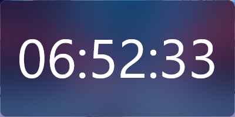

# FrostBehind

A Rainmeter plugin that applies Windows acrylic and blur effects with customizable corner styles to your skin windows.



## Features

- **Acrylic Effect**: Modern frosted glass appearance
- **Blur Effect**: Classic blur behind effect
- **Customizable Corners**: Choose between rounded, small rounded, or default corners
- **Lightweight**: Minimal performance impact

## Usage

Add the plugin measure to your skin's `.ini` file:

```ini
[Measure_FrostBehind]
Measure=Plugin
Plugin=FrostBehind
Type=Acrylic
Corner=Round
```

## Configuration Options

### Type
Controls the background effect applied to the skin window.

- `Acrylic` - Applies Windows acrylic effect (frosted glass)
- `Blur` - Applies blur behind effect
- `None` - Disables any effect (default)

### Corner
Controls the corner style of the skin window.

- `Round` - Rounded corners
- `RoundSmall` - Small rounded corners
- `None` - Default/square corners (default)

## Example

```ini
[Rainmeter]
Update=1000
AccurateText=1

[Metadata]
Name=FrostBehind
Author=nstechbytes
Version=1.0.0
License=MIT

[Measure_FrostBehind]
Measure=Plugin
Plugin=FrostBehind
Type=Acrylic
Corner=Round

[BackGround_Shape]
Meter=Shape
Shape=Rectangle 0,0,400,200 | StrokeWidth 0 | FillColor 10,10,10,100
```

## Requirements

- Windows 10 version 1803 or later (for Acrylic effect)
- Windows 11 (for rounded corners)
- Rainmeter 4.0 or later

## License

MIT License - See LICENSE file for details

## Author

**nstechbytes**  
GitHub: [@nstechbytes](https://github.com/nstechbytes)

## Support

For issues, questions, or contributions, please visit the GitHub repository.